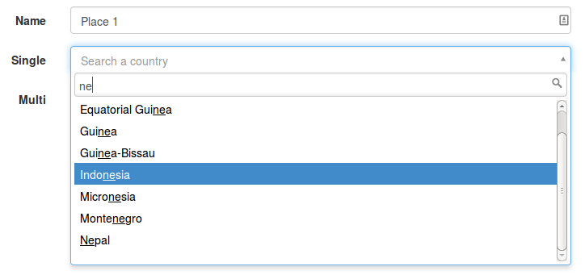
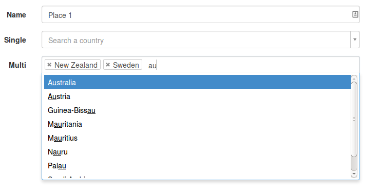

select2table-bundle
====================

## Introduction

This is a Symfony bundle which enables the popular [Select2](https://select2.github.io) component to be used as a drop-in replacement for a standard entity field on a Symfony form.

It works with Symfony 4 and upper versions.

The main feature that this bundle provides compared with the standard Symfony entity field (rendered with a html select) is that the list is retrieved via a remote ajax call. This means that the list can be of almost unlimited size. The only limitation is the performance of the database query or whatever that retrieves the data in the remote web service.

It works with both single and multiple selections. If the form is editing a Symfony entity then these modes correspond with many to one and many to many relationships. In multiple mode, most people find the Select2 user interface easier to use than a standard select tag with multiple=true with involves awkward use of the ctrl key etc.

The project was inspired by [tetranz/select2entity-bundle](https://github.com/lifo101/typeahead-bundle) which uses the Typeahead component in Bootstrap 2 to provide similar functionality. Select2Table can be used anywhere Select2 can be installed, including Bootstrap 3.

Thanks to @ismailbaskin we now have Select2 version 4 compatibility.

## Screenshots

This is a form with a single selection field list expanded.



This is a form with a multiple selection field list expanded.



## Installation

Select2 must be installed and working first. I hope to setup a demo site but my setup is basically [BraincraftedBootstrapBundle](http://bootstrap.braincrafted.com) with Select2 installed for Bootstrap 3. Once the Braincrafted bundle is working, the only files I've needed to install are:

select2.js, select2.css from https://github.com/select2/select2/tree/4.0.0

select2-bootstrap.css from https://github.com/t0m/select2-bootstrap-css/tree/bootstrap3. That gets it working for Bootstrap 3.

These files live in the Resources/public/js and Resources/public/css folders of one of my bundles and then included in my main layout.html.twig file.

Alternatively, minified versions of select2.js and select2.css can be loaded from the CloudFlare CDN using the two lines of code given here: [https://select2.github.io](https://select2.github.io). Make sure the script tag comes after where jQuery is loaded. That might be in the page footer.

* Add `feroz/select2table-bundle` to your projects `composer.json` "requires" section:

```javascript
{
    // ...
    "require": {
        // ...
        "feroz/select2table-bundle": "2.*"
    }
}
```
Note that this only works with Select2 version 4. If you are using Select2 version 3.X please use `"tetranz/select2entity-bundle": "1.*"` in `composer.json`

* Run `php composer.phar update feroz/select2table-bundle` in your project root.
* Update your project `config/bundles.php` file and add this bundle to the $bundles array:

```php
$bundles = [
    // ...
    Feroz\Select2TableBundle\TetranzSelect2EntityBundle::class => ['all' => true]
];
```

* Update your project `config/packages/twig.yaml` file to provide global twig form templates:

```yaml
twig:
    form_themes:
        - '@FerozSelect2Table/Form/fields.html.twig'

* Load the Javascript on the page. The simplest way is to add the following to your layout file. Don't forget to run console assets:install. Alternatively, do something more sophisticated with Assetic.
```

```
<script src="{{ asset('bundles/tetranzselect2table/js/select2table.js') }}"></script>
```

## How to use

The following is for Symfony 4 and upper version. 
Select2Table is simple to use. In the buildForm method of a form type class, specify `Select2TableType::class` as the type where you would otherwise use `entity:class`.

Here's an example:

```php
$builder
   ->add('country', Select2TableType::class, [
            'multiple' => true,
            'remote_route' => 'feroz_test_default_countryquery',
            'remote_params' => [], // static route parameters for request->query
            'table_name' => 'tbl_countries',
            'primary_key' => 'id',
            'text_property' => 'name',
            'minimum_input_length' => 2,
            'page_limit' => 10,
            'allow_clear' => true,
            'delay' => 250,
            'cache' => true,
            'cache_timeout' => 60000, // if 'cache' is true
            'language' => 'en',
            'placeholder' => 'Select a country',
            'query_parameters' => [
                'start' => new \DateTime(),
                'end' => (new \DateTime())->modify('+5d'),
                // any other parameters you want your ajax route request->query to get, that you might want to modify dynamically
            ],
           
        ])
```
Put this at the top of the file with the form type class:
```php
use Feroz\Select2TableBundle\Form\Type\Select2TableType;
```

## Options
Defaults will be used for some if not set.
* `table_name` is your table name. Required
* `primary_key` is the name of the property used to uniquely identify entities. Defaults to 'id'
* `text_property` This is the entity property used to retrieve the text for existing data. 
If text_property is omitted then the entity is cast to a string. This requires it to have a __toString() method.
* `multiple` True for multiple select (many to many). False for single (many to one) select.
* `minimum_input_length` is the number of keys you need to hit before the search will happen. Defaults to 2.
* `page_limit` This is passed as a query parameter to the remote call. It is intended to be used to limit size of the list returned. Defaults to 10.
* `scroll` True will enable infinite scrolling. Defaults to false.
* `allow_clear` True will cause Select2 to display a small x for clearing the value. Defaults to false.
* `delay` The delay in milliseconds after a keystroke before trigging another AJAX request. Defaults to 250 ms.
* `placeholder` Placeholder text.
* `language` i18n language code. Defaults to en.
* `theme` Defaults to 'default'.
* `cache` Enable AJAX cache. Results will be cached for each 'term' queried.
* `cache_timeout` How long to cache a query in milliseconds. Setting to `0` will cause the cache to never timeout _(60000 = 60 seconds)_
* `transformer` The fully qualified class name of a custom transformer if you need that flexibility as described below.
* `autostart` Determines whether or not the select2 jQuery code is called automatically on document ready. Defaults to true which provides normal operation.
* `width` Sets a data-width attribute if not null. Defaults to null.
* `render_html` This will render your results returned under ['html'].

The url of the remote query can be given by either of two ways: `remote_route` is the Symfony route. 
`remote_params` can be optionally specified to provide parameters. Alternatively, `remote_path` can be used to specify 
the url directly.

You may use `query_parameters` for when those remote_params have to be changeable dynamically. You may change them using $('#elem').data('query-parameters', { /* new params */ });

The defaults can be changed in your config/packages/tetranzselect2entity.yaml file with the following format.

```yaml
feroz_select2_table:
    minimum_input_length: 2
    page_limit: 8
    allow_clear: true
    delay: 500
    language: 'fr'
    theme: 'default'
    cache: false
    cache_timeout: 0
    scroll: true
    render_html: true
```

## AJAX Response
The controller should return a `JSON` array in the following format. The properties must be `id` and `text`.

```javascript
[
  { id: 1, text: 'Displayed Text 1' },
  { id: 2, text: 'Displayed Text 2' }
]
```
## Infinite Scrolling
If your results are being paged via the Select2 "infinite scrolling" feature then you can either continue to return
the same array as shown above _(for Backwards Compatibility this bundle will automatically try to determine if more 
results are needed)_, or you can return an object shown below to have finer control over the paged results.

The `more` field should be true if there are more results to be loaded. 

```javascript
{
  results: [
     { id: 1, text: 'Displayed Text 1' },
     { id: 2, text: 'Displayed Text 2' }
  ],
  more: true
}
```
Your controller action that fetches the results will receive a parameter `page` indicating what page of results should
be loaded. If you set scroll to true then you must handle the page parameter in the query. Weird things will happen if you don't.

## Custom option text
If you need more flexibility in what you display as the text for each option, such as displaying the values of several fields from your entity or showing an image inside, you may define your own custom transformer.
Your transformer must implement DataTransformerInterface. The easiest way is probably to extend EntityToPropertyTransformer or EntitiesToPropertyTransformer and redefine the transform() method. This way you can return as `text` anything you want, not just one entity property.

Here's an example that returns the country name and continent (two different properties in the Country entity):
```php
$builder
    ->add('country', Select2TableType::class, [
        'multiple' => true,
        'remote_route' => 'feroz_test_default_countryquery',
        'table_name' => 'tbl_country',
        'transformer' => '\Feroz\TestBundle\Form\DataTransformer\CountryTablesToPropertyTransformer',
    ]);
```
In transform sets data array like this:
```php
$data[] = array(
    'id' => $row['id'],
    'text' => $row['name'].' ('.$row['continent_name'].')',
);
```
Your custom transformer and respectively your Ajax controller should return an array in the following format:
```javascript
[ 
    { id: 1, text: 'United Kingdom (Europe)' },
    { id: 1, text: 'China (Asia)' }
]
```
If you are using the allow_add option and your entity requires other fields besides the text_property field to be valid, you will either need to extend the EntitiesToPropertyTransformer to add the missing field, create a doctrine prePersist listener, or add the missing data in the form view after submit before saving.


### Including other field values in request

If you need to include other field values because the selection depends on it you can add the `req_params` option.
The key is the name of the parameter in the query string, the value is the path in the FormView (if you don't know the path you can do something like `{{ dump(form) }}` in your template.) 

The `property` option refers to your entity field which is used for the label as well as for the search term.

In the callback you get the QueryBuilder to modify the result query and the data object as parameter (data can be a simple Request object or a plain array. See AutocompleteService.php for more details). 

```php
$builder
    ->add('firstName', TextType::class)
        ->add('lastName', TextType::class)
        ->add('state', EntityType::class, array('class' => State::class))
        ->add('county', Select2TableType::class, [
            'required' => true,
            'multiple' => false,
            'remote_route' => 'ajax_autocomplete',
            'table_name' => tbl_coutries,
            'minimum_input_length' => 0,
            'page_limit' => 10,
            'scroll' => true,
            'allow_clear' => false,
            'req_params' => ['state' => 'parent.children[state]'],
            'property' => 'name',
            'callback'    => function (QueryBuilder $qb, $data) {
                $qb->andWhere('state = :state');

                if ($data instanceof Request) {
                    $qb->setParameter('state', $data->get('state'));
                } else {
                    $qb->setParameter('state', $data['state']);
                }

            },
        ])
    ->add('city', Select2TableType::class, [
        'required' => true,
        'multiple' => false,
        'remote_route' => 'ajax_autocomplete',
        'table_name' => tbl_cities,
        'minimum_input_length' => 0,
        'page_limit' => 10,
        'scroll' => true,
        'allow_clear' => false,
        'req_params' => ['county' => 'parent.children[county]'],
        'property' => 'name',
        'callback'    => function (QueryBuilder $qb, $data) {
            $qb->andWhere('county = :county');

            if ($data instanceof Request) {
                $qb->setParameter('county', $data->get('county'));
            } else {
                $qb->setParameter('county', $data['county']);
            }

        },
    ]);
``` 

Because the handling of requests is usually very similar you can use a service which helps you with your results. To use it just add a route in one of your controllers:

```php
    /**
     * @param Request $request
     *
     * @Route("/autocomplete", name="ajax_autocomplete")
     *
     * @return Response
     */
    public function autocompleteAction(Request $request)
    {
        // Check security etc. if needed
    
        $as = $this->get('ferozselect2table.autocomplete_service');

        $result = $as->getAutocompleteResults($request, YourFormType::class);

        return new JsonResponse($result);
    }
```


### Templating

General templating has now been added to the bundle. If you need to render html code inside your selection results, set the `render_html` option to true and in your controller return data like this:
```javascript
[ 
    { id: 1, text: 'United Kingdom (Europe)', html: '' },
    { id: 2, text: 'China (Asia)', html: '' }
]
```

<details><summary>If you need further templating, you'll need to override the .select2entity() method as follows.</summary>
If you need [Templating](https://select2.org/dropdown#templating) in Select2, you could consider the following example that shows the country flag next to each option.

Your custom transformer should return data like this:
```javascript
[ 
    { id: 1, text: 'United Kingdom (Europe)', img: 'images/flags/en.png' },
    { id: 2, text: 'China (Asia)', img: 'images/flags/ch.png' }
]
```
You need to define your own JavaScript function `select2entityAjax` which extends the original one `select2entity` and display custom template with image:
```javascript
$.fn.select2tableAjax = function(action) {
    var action = action || {};
    var template = function (item) {
        var img = item.img || null;
        if (!img) {
            if (item.element && item.element.dataset.img) {
                img = item.element.dataset.img;
            } else {
                return item.text;
            }
        }
        return $(
            '<span> ' + item.text + '</span>'
        );
    };
    this.select2table($.extend(action, {
        templateResult: template,
        templateSelection: template
    }));
    return this;
};
$('.select2table').select2tableAjax();
```
This script will add the functionality globally for all elements with class `select2entity`, but if the `img` is not passed it will work as the original `select2entity`. 
You should add a `'autostart' => false` to form to run properly JS code.
````php
    ->add('contry', Select2TableType::class, [
        'remote_route' => 'country_select2_query',
        'autostart' => false,
    ])
````


You also will need to override the following block in your template:
```twig

    <option value="{{ label.id }}" selected="selected"
            
                 data-{{ key }}="{{ data }}"
            >
        {{ label.text }}
    </option>

```
This block adds all additional data needed to the JavaScript function `select2entityAjax`, like data attribute. In this case we are passing `data-img`.</details>

### Themes
Select2 supports custom themes using the `theme` option so you can style Select2 to match the rest of your application.
For Bootstrap4 theme look at https://github.com/ttskch/select2-bootstrap4-theme

## Embed Collection Forms
If you use [Embedded Collection Forms](http://symfony.com/doc/current/cookbook/form/form_collections.html) and [data-prototype](http://symfony.com/doc/current/cookbook/form/form_collections.html#allowing-new-tags-with-the-prototype) to add new elements in your form, you will need the following JavaScript that will listen for adding an element `.select2entity`:
```javascript
$('body').on('click', '[data-prototype]', function(e) {
    $(this).prev().find('.select2table').last().select2table();
});
```
